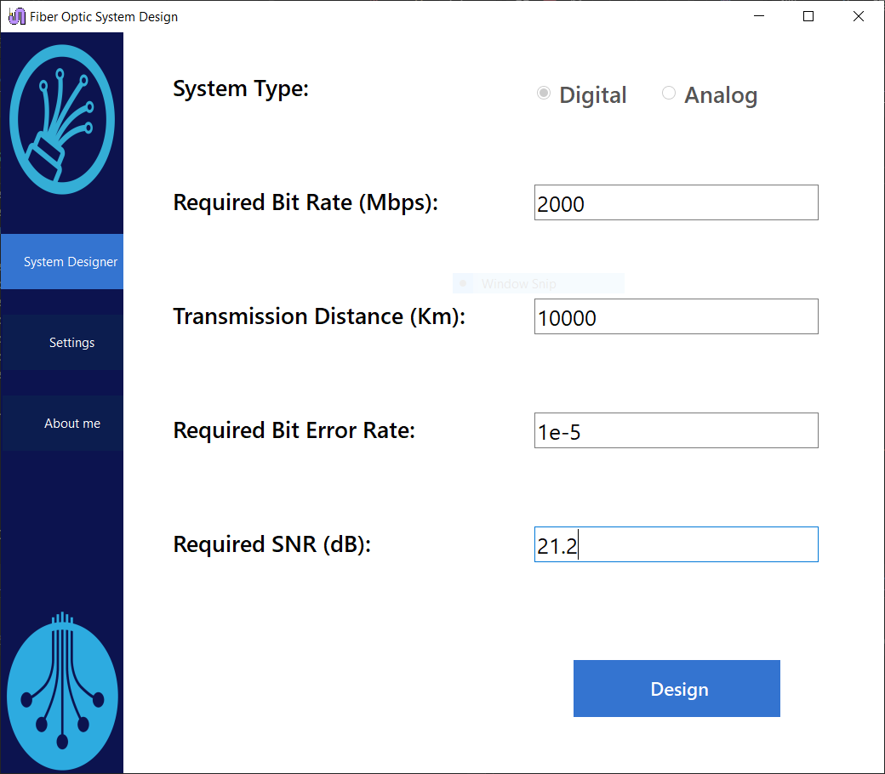
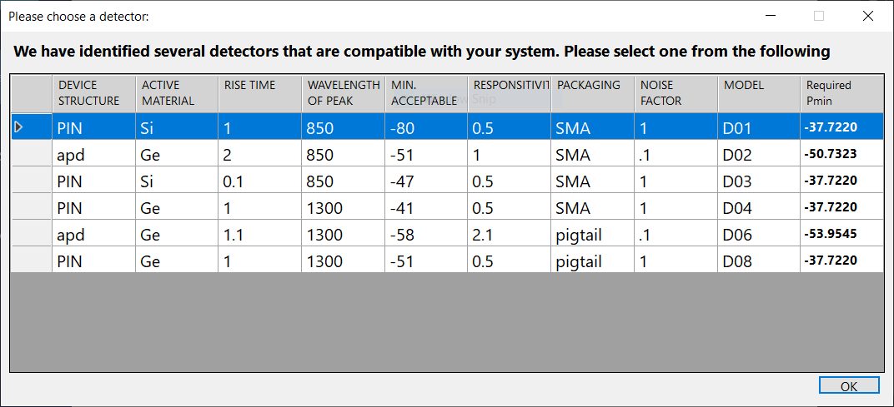
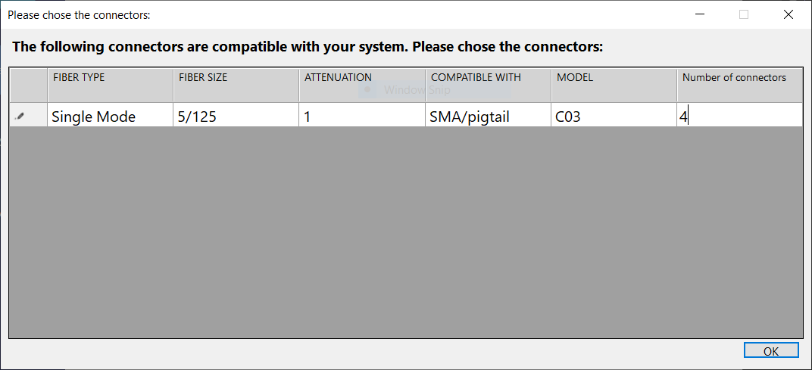
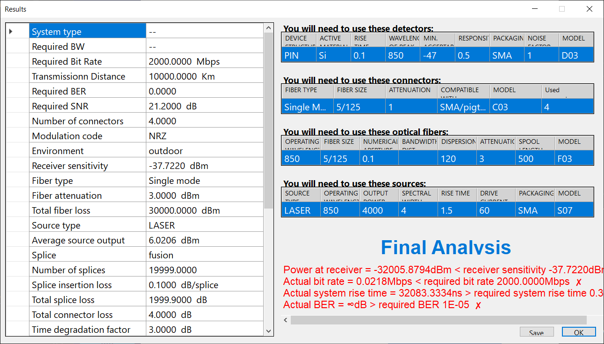

# Fiber Optic System Designer

A **C# Windows Forms desktop application** for designing and evaluating **fiber optic communication systems** based on user-defined requirements.

The tool takes key system parameters, automatically selects compatible components, performs system calculations, and presents detailed results that can be exported to Excel.

---

## System Configuration

The user defines the required system characteristics, including:

* System type (digital or analog)
* Required bit rate
* Transmission distance
* Bit error rate (BER)
* Signal-to-noise ratio (SNR)

These inputs drive all calculations and component selection.

---

## Component Selection

### Photodetectors

Based on the system requirements, the application identifies compatible **photodetectors** and allows the user to choose the most suitable option.
Each detector includes parameters such as rise time, operating wavelength, responsivity, noise factor, and receiver sensitivity.

### Connectors, Fibers, and Sources

The system then selects compatible:

* **Connectors**
* **Optical fibers**
* **Optical sources (LED / LASER)**

Selections are made to satisfy system constraints while accounting for attenuation, dispersion, and bandwidth limitations.

---

## Results and Final Analysis

The application presents a complete system summary, including:

* Required vs actual bit rate
* Total fiber, splice, and connector losses
* Received power vs receiver sensitivity
* System rise time and BER evaluation

A final feasibility analysis clearly indicates whether the designed system meets the required specifications.

---

## Technologies Used

* **C#**
* **Windows Forms**
* Excel file export

---

## Notes

* Windows-only desktop application
* Developed as an academic engineering project
